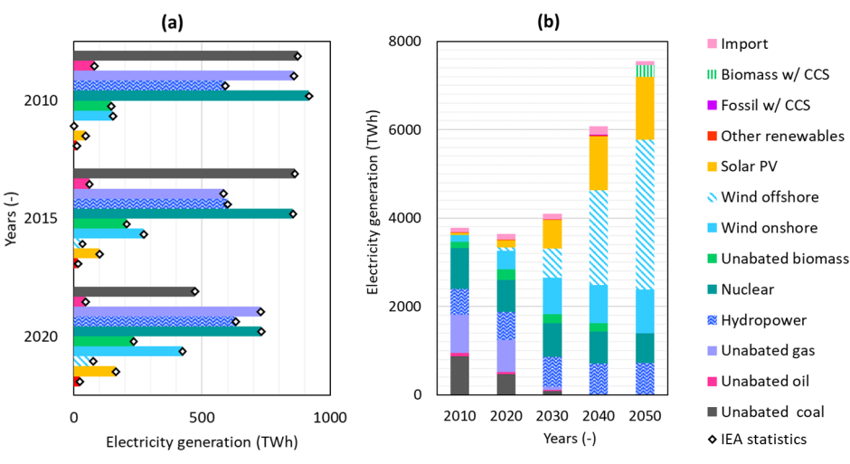
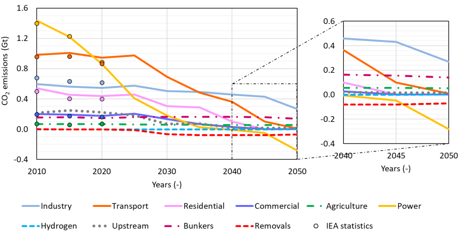

# **TEMOA-Europe**
TEMOA-Europe is a model instance for the optimization of the European energy system developed within an [extended version](https://github.com/MAHTEP/TEMOA) of the [TEMOA](https://temoacloud.com/) (Tools for Energy Modeling Optimization and Analysis) modeling framework.
The model is maintained by the [MAHTEP Group](http://www.mahtep.polito.it/) at [Department of Energy](https://www.denerg.polito.it/en/) of [Politecnico di Torino](https://www.polito.it/en). For any inquiries concerning TEMOA-Europe, please contact [Laura Savoldi, Valeria di Cosmo and Matteo Nicoli](mailto:laura.savoldi@polito.it;valeria.dicosmo@unito.it;matteo.nicoli@polito.it).

## **Model Overview**
The TEMOA-Europe model is a comprehensive representation of the European energy system, designed to perform long-term energy system optimization analyses within an open-database and open-software environment.
TEMOA-Europe is built using the TEMOA framework and operates as a capacity expansion energy system optimization model (ESOM). It evaluates the least-cost configuration of energy system technologies and resource allocations to meet predefined energy demands across multiple sectors. The model covers OECD Europe as a single region, using 2005 as the base year and extending its projections to mid-century [1].

## **Methodology and Assumptions**
TEMOA-Europe works under a partial equilibrium framework, where commodity production and consumption are balanced to maximize producer and consumer surplus, reflecting economic welfare. The model assumes perfectly competitive markets with perfect foresight across the entire planning horizon. Energy demands are fixed inputs and must be fully satisfied at each time step.

## **Regional Representation**
The model represents the entire OECD Europe as a single region to simplify data handling and computational requirements while maintaining relevance for EU-level policy analysis. Energy statistics are sourced from the IEA and adjusted based on the EUROfusion TIMES Model. Import and export processes link Europe to the rest of the world, with distinct costs and constraints applied to different trade routes.

## **Energy Supply Modules**
The energy supply side of TEMOA-Europe includes fossil fuel extraction, nuclear fuel cycle processes, renewable energy generation, hydrogen production, carbon capture, utilization and storage (CCUS), and biofuel production [1].

- Fossil Fuel Extraction: Inland extraction of coal, oil, and natural gas with options for trade.
- Nuclear Fuel Cycle: Includes uranium mining, enrichment, and reprocessing of spent fuel.
- Renewable Energy: Covers geothermal, hydro, solar, wind, biomass, and marine sources.
- Hydrogen Production: Multiple pathways, including fossil fuel reforming, biomass gasification, and electrolysis.
- CCUS: Captures CO2 from power and industrial processes for storage or utilization.
- Biofuels Production: Converts various biomass feedstocks into liquid and gaseous fuels.

Figure 1. Electricity generation mix from 2010 to 2050 evaluated with TEMOA-Europe. [1]

## **Energy Demand Modules**
Demand sectors include residential, commercial, industrial, transport, and agriculture. Each sector features a variety of technologies to meet final energy service demands, which must be satisfied in every time step.

- Industry: Detailed modeling of energy-intensive subsectors such as steel, cement, and chemicals.
- Transport: Includes road, rail, aviation, and maritime modes with evolving technology options.
- Buildings: Simulates heating, cooling, and appliance usage.
- Agriculture: Considers energy needs for mechanized processes.
## **CO2 Emissions and Mitigation**
TEMOA-Europe tracks greenhouse gas emissions across all sectors and evaluates the potential of various mitigation strategies. Emissions reductions are achieved through energy efficiency improvements, fuel switching, and carbon capture technologies [2], [3].

Figure 2. CO2 emissions trajectory by sector evaluated with TEMOA-Europe. [1]

## **Data Sources and Calibration**
The model relies on publicly available data from the IEA, ETM, TIAM-WORLD, and other sources. Technology costs, efficiencies, and operational characteristics are based on literature and existing ESOM databases, with updates for key parameters such as renewable energy costs [1].

## **Applications and Relevance**
TEMOA-Europe supports the evaluation of policies related to the European Green Deal, energy security, and decarbonization pathways. Its open-source nature ensures transparency and reproducibility for researchers, policymakers, and stakeholders.

## **References**
1. D. Lerede, V. Di Cosmo, and L. Savoldi, “TEMOA-europe: An open-source and open-data energy system optimization model for the analysis of the European energy mix,” *Energy*, vol. 308, p. 132850, Nov. 2024, doi: 10.1016/J.ENERGY.2024.132850.
2. G. Colucci, D. Lerede, M. Nicoli, and L. Savoldi, “A dynamic accounting method for CO2 emissions to assess the penetration of low-carbon fuels: application to the TEMOA-Italy energy system optimization model,” *Appl Energy*, vol. 352, no. 121951, Dec. 2023, doi: 10.1016/j.apenergy.2023.121951.
3. G. Colucci, D. Lerede, M. Nicoli, and L. Savoldi, “Dynamic Accounting for End-Use CO2 Emissions From Low-Carbon Fuels in Energy System Optimization Models,” *Energy Proceedings*, vol. 29, 2022, doi: 10.46855/energy-proceedings-10294.

## **Contributions**
The developing team wishes to receive help form the users in the definition and test of new test cases, in the benchmark against other established software, in the update of other functionalities.
To contribute please refer to [contribution](CONTRIBUTION.md).

## **Code of Conduct**
The developing team agreed to embrace the  **Code of Conduct**.
 
## **License**
TEMOA-Europe is licensed under  or any other version of it.

